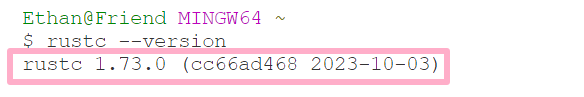
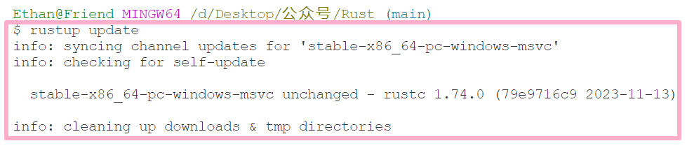
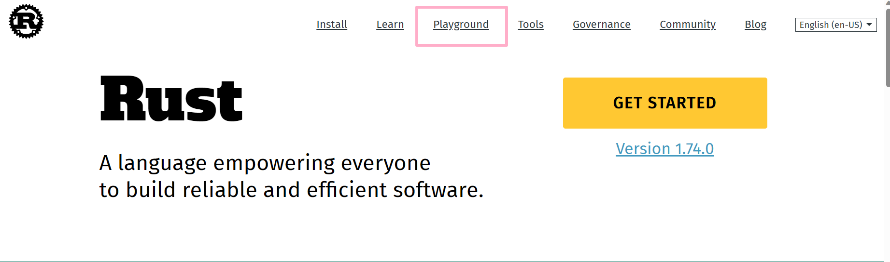
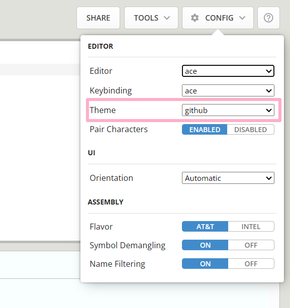
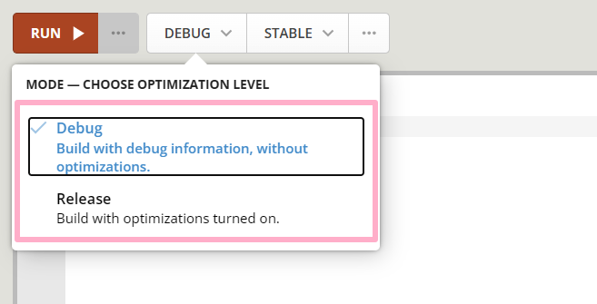

## 1 编程准备

### 1. 安装 Rust：
Rust 官方网站（rust-lang.org）以获取安装 Rust 的详细信息，包括文档、安装说明和相关学习材料。Rust 兼具系统编程语言和高级语言的优势。可以使用VSCode里的插件进行安装。

  

### 2. 使用 Visual Studio Code：
推荐使用 Visual Studio Code 作为编辑器，并安装 Rust 插件以提高编码效率。

  

###  3. 检查 Rust 安装：
通过终端命令 `rustc --version` 检查 Rust 编译器的安装情况。

  

  

  

###  4. Rust 包管理器 Cargo：
Rust 的包管理器 Cargo，通过命令 `cargo --version` 检查其安装情况。

  

### 5. Rust 更新命令：
在开始编写代码之前使用 `rustup update` 命令保持 Rust 为最新版本。

  

### 6. 在线编译器：
可以使用官方网站上的在线编译器快速运行程序。

  

  

  

Debug模式是为了调试程序而设计的，它编译速度快，但运行速度慢；  
Release模式是为了发布程序而设计的，它编译速度慢，但运行速度快；  
当完成产品并想要交付给别人使用时，应该不在乎编译时间，选择Release模式。

  

### 7. Visual Studio Code 工具和扩展：
官网 Playground 的 Rustfmt 和 Clippy 工具，用于格式化和提供编码建议。

### 8. 其他编辑器选择：
推荐使用 Visual Studio Code，但还有其他可用的编辑器，可以在官方网站的 Tools 部分找到列表

### 9. 分享代码：
通过 Share 选项可以分享代码的便捷性，包括创建链接和分享到论坛
