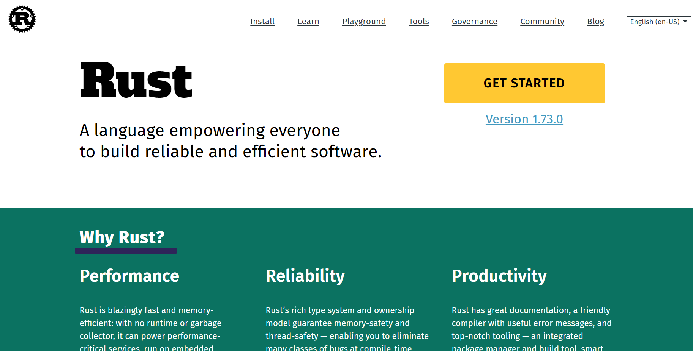
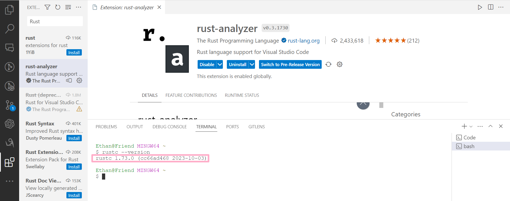
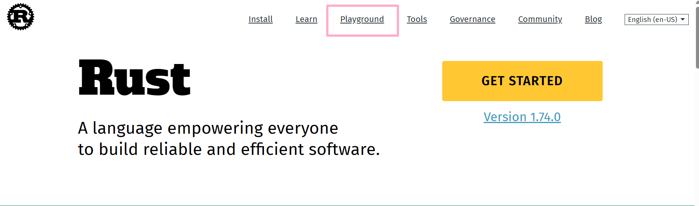
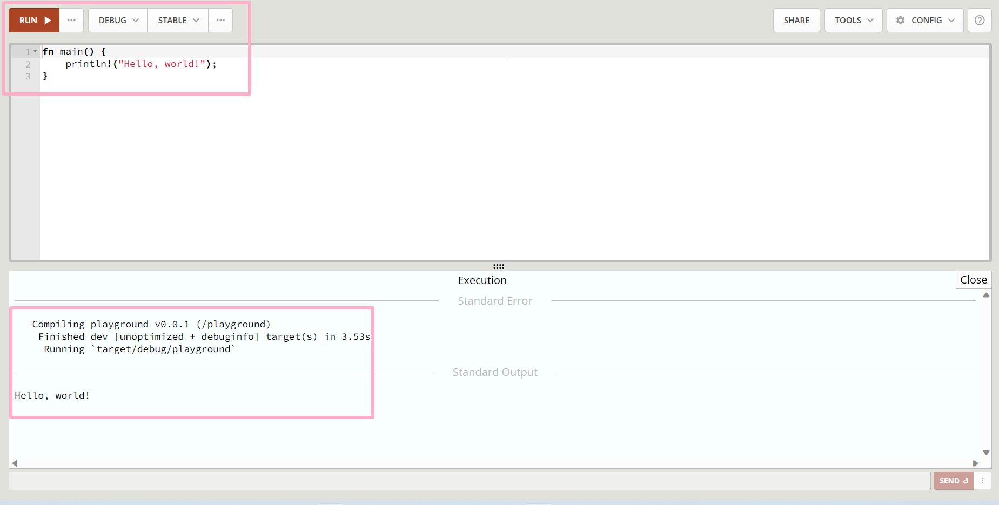
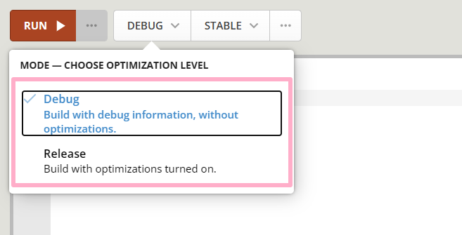
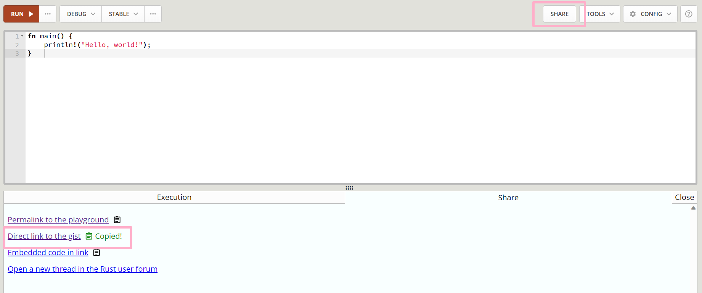
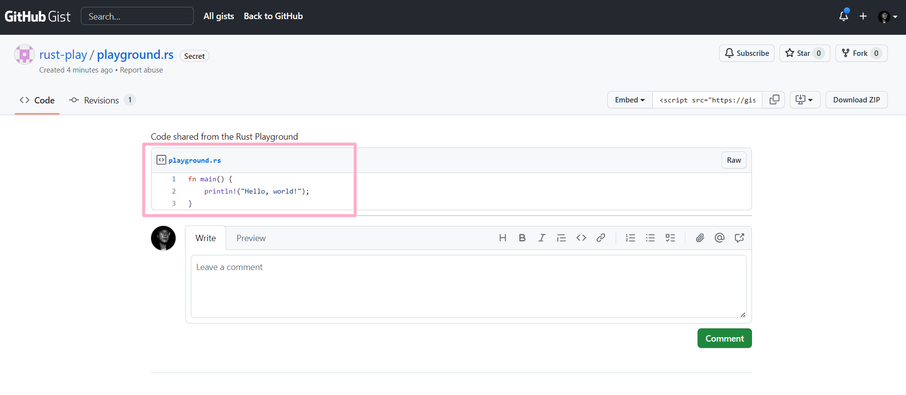
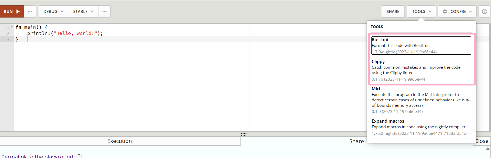
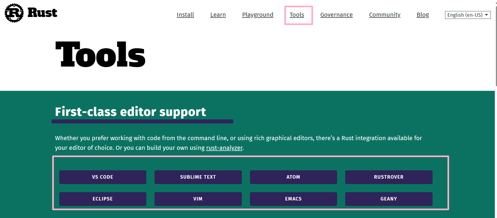

## Programming Preparation

### 1. Install Rust:
Visit the official Rust website (rust-lang.org) for detailed instructions on installing Rust, including documentation, installation guidelines, and related learning materials. 
Rust combines the advantages of a system programming language and a high-level language. 
You can install it using the Rust plugin within VSCode.

  

### 2. Use Visual Studio Code:
Recommend using Visual Studio Code as an editor and install the Rust plugin to enhance coding efficiency.

  

### 3. Check Rust Installation:
Check the installation of the Rust compiler by using the terminal command `rustc --version`.

  

  

  

### 4. Rust Package Manager Cargo:
Check the installation of Rust's package manager Cargo by using the command `cargo --version`.

  

### 5. Rust Update Command:
Before starting coding, use the `rustup update` command to ensure Rust is the latest version.

  

### 6. Online Compiler:
You can swiftly run programs using the online compiler available on the official website.

  

  

  

#### 6.1. Choose Mode and Channel
- Debug Mode: Designed for debugging, it compiles quickly but runs slowly.
- Release Mode: Designed for program release, it compiles slowly but runs quickly.
- When delivering a product and speed is crucial, opt for Release Mode.

  

STABLE is a stable and reliable version, while Beta and Nightly contain new features that are being developed and tested, which may become part of future Rust versions.

  

#### 6.2 Share Code
Through the Share option, you can share code, including creating links and sharing to forums.
By clicking "Share," you can share updated code links.
To get updated code links, compile and run the program; otherwise, the "Share" link will refer to the last executed program.

  

  

If encountering problems and needing help, clicking this button directs to the forum to share the issue.

  

  

#### 6.3 Tools:
Rustfmt and Clippy tools on the official Playground for formatting and coding suggestions:
- Rustfmt: In Rust, formatting isn't crucial, but this tool helps with automatic formatting, which is convenient.
- Clippy: Offers valuable suggestions while coding.

  

### 7. Other Editor Options
While Visual Studio Code is recommended, there are other available editors listed in the Tools section on the official website.

  

