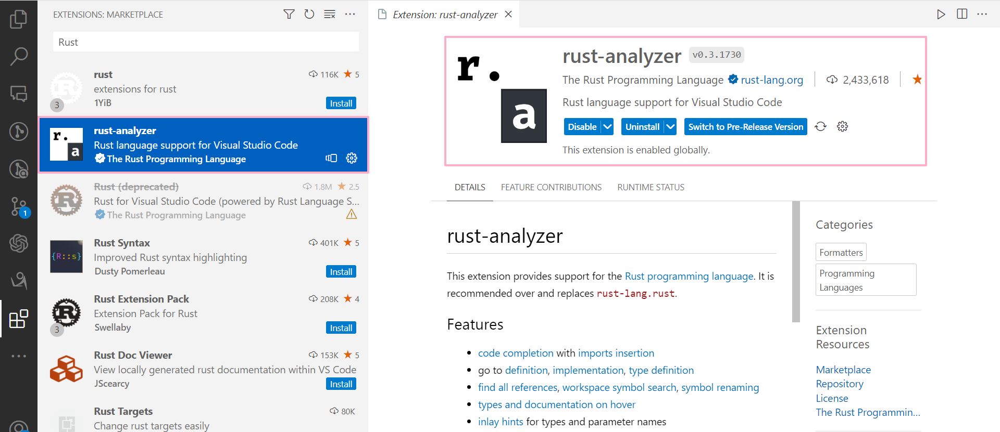
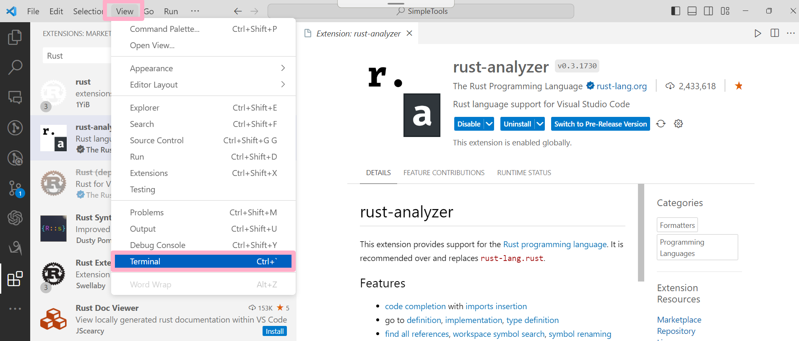
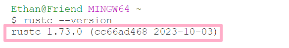
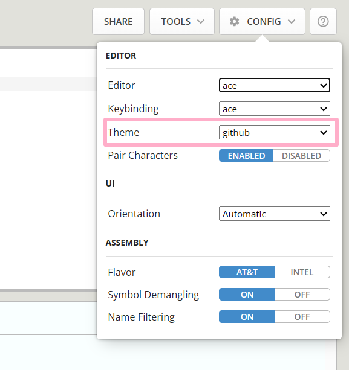
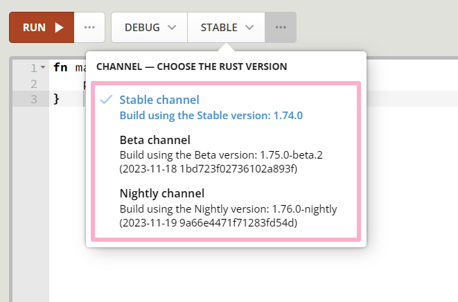
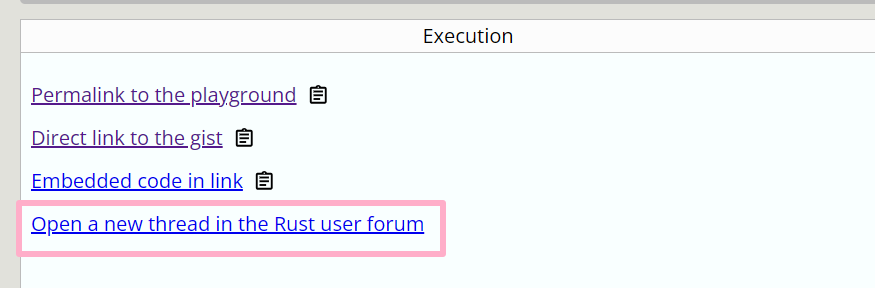

## Programming Preparation

### 1. Install Rust:
Visit the official Rust website (rust-lang.org) for detailed instructions on installing Rust, including documentation, installation guidelines, and related learning materials. 
Rust combines the advantages of a system programming language and a high-level language. 
You can install it using the Rust plugin within VSCode.

  

### 2. Use Visual Studio Code:
Recommend using Visual Studio Code as an editor and install the Rust plugin to enhance coding efficiency.

  

### 3. Check Rust Installation:
Check the installation of the Rust compiler by using the terminal command `rustc --version`.

  

  

  

### 4. Rust Package Manager Cargo:
Check the installation of Rust's package manager Cargo by using the command `cargo --version`.

  

### 5. Rust Update Command:
Before starting coding, use the `rustup update` command to ensure Rust is the latest version.

  

### 6. Online Compiler:
You can swiftly run programs using the online compiler available on the official website.

  

  

  

#### 6.1. Choose Mode and Channel
- Debug Mode: Designed for debugging, it compiles quickly but runs slowly.
- Release Mode: Designed for program release, it compiles slowly but runs quickly.
- When delivering a product and speed is crucial, opt for Release Mode.

  

STABLE is a stable and reliable version, while Beta and Nightly contain new features that are being developed and tested, which may become part of future Rust versions.

  

#### 6.2 Share Code
Through the Share option, you can share code, including creating links and sharing to forums.
By clicking "Share," you can share updated code links.
To get updated code links, compile and run the program; otherwise, the "Share" link will refer to the last executed program.

  

  

If encountering problems and needing help, clicking this button directs to the forum to share the issue.

  

  

#### 6.3 Tools:
Rustfmt and Clippy tools on the official Playground for formatting and coding suggestions:
- Rustfmt: In Rust, formatting isn't crucial, but this tool helps with automatic formatting, which is convenient.
- Clippy: Offers valuable suggestions while coding.

  

### 7. Other Editor Options
While Visual Studio Code is recommended, there are other available editors listed in the Tools section on the official website.

  

---

## 编程准备

### 1. 安装 Rust
Rust 官方网站（rust-lang.org）以获取安装 Rust 的详细信息，包括文档、安装说明和相关学习材料；  
Rust 兼具系统编程语言和高级语言的优势；  
可以使用VSCode里的插件进行安装。

  

### 2. 使用 Visual Studio Code
推荐使用 Visual Studio Code 作为编辑器，并安装 Rust 插件以提高编码效率。

  

### 3. 检查 Rust 安装
通过终端命令 `rustc --version` 检查 Rust 编译器的安装情况。

  

  

  

### 4. Rust 包管理器 Cargo
Rust 的包管理器 Cargo，通过命令 `cargo --version` 检查其安装情况。

  

### 5. Rust 更新命令
在开始编写代码之前使用 `rustup update` 命令保持 Rust 为最新版本。

  

### 6. 在线编译器
可以使用官方网站上的在线编译器快速运行程序。

  

  

  

#### 6.1. 选择模式与通道
Debug模式是为了调试程序而设计的，它编译速度快，但运行速度慢；  
Release模式是为了发布程序而设计的，它编译速度慢，但运行速度快；  
当完成产品并想要交付给别人使用时，应该不在乎编译时间，选择Release模式。

  

STABLE是稳定且可靠的版本，而Beta和Nightly则包含正在开发和测试的新功能，可能会成为未来Rust版本的一部分。

  

#### 6.2 分享代码
通过 Share 选项可以分享代码，包括创建链接和分享到论坛;  
点击“分享”，这样就能分享更新后的代码链接;  
为了获取更新后的代码链接，需要先编译和运行程序，否则“分享”链接将一直指向最近执行的程序;

  

  

如果遇到问题需要帮助，可以点击这个按钮，进入论坛分享问题。

  

  

#### 6.3 工具
官网 Playground 的 Rustfmt 和 Clippy 工具，用于格式化和提供编码建议：

- Rustfmt（Rust格式化工具）： 在Rust中，只有语法才重要，但这个工具可以帮助你自动处理格式，非常方便。
- Clippy： Clippy 提供了很多在编写代码时的好建议。

  

### 7. 其他编辑器选择
推荐使用 Visual Studio Code，但还有其他可用的编辑器，可以在官方网站的 Tools 部分找到列表。

  

