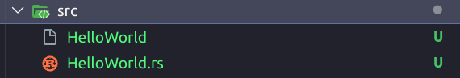
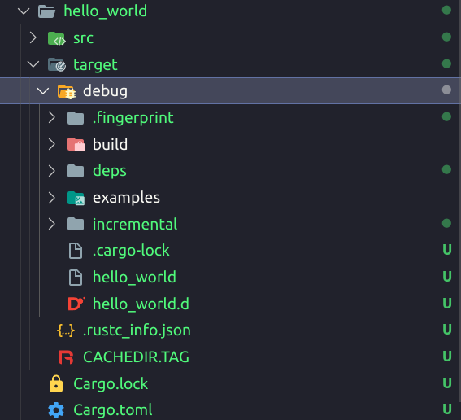
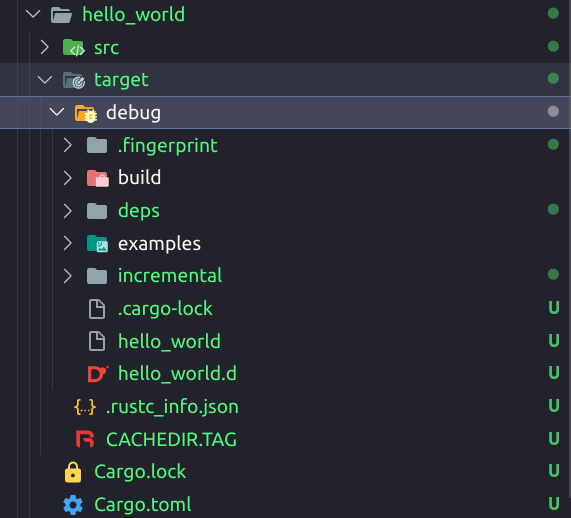
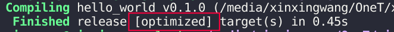
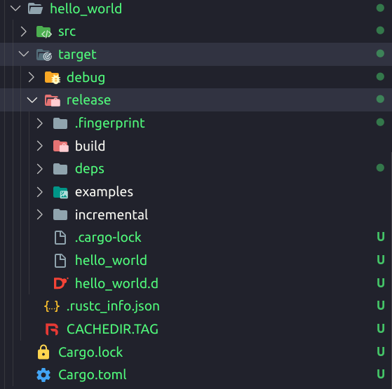

### Overview of Compiling and Executing Rust Programs

#### The basics of compiling and executing Rust programs

1. **Creating and Compiling Files:**
   - Create a new folder to store Rust files and create a file with the `.rs` extension, like `HelloWorld.rs`.
   - Rust files typically end with the `.rs` extension. Add a `main` function as the entry point to the program.

   <p align="center">
      
   </p>
   ```rust
   fn main() {
    println!("Hello World!");
   }
   ```

2. **Manual Compilation and Execution:**
   - Use the `rustc` command with the file name for manual compilation. It generates an executable file.
   - Run the program in the terminal using `./filename` to view the output.

   ```bash
   rustc HelloWorld.rs
   ./HelloWorld
   ```

   <p align="center">
      
   </p>
   <p align="center">
      
   </p>
   <p align="center">
      
   </p>
   <p align="center">
      
   </p>

3. **Building and Running with Cargo:**
   - Cargo, Rust's package manager, initializes a new project with `cargo new folder_name`.

   ```rust
   cargo new hello_world
   ```

   <p align="center">
      
   </p>

   - `Cargo.toml` file contains project information and dependencies. `src` folder holds `.rs` source files.

   <p align="center">
     
   </p>

   - Use `cargo run` to compile and execute the program, displaying the output in the terminal.

   ```bash
   cd HelloRust/
   cargo run
   ```

   <p align="center">
     
   </p>

   <p align="center">
     
   </p>

   - `cargo build` constructs the program without execution.

   ```bash
   cargo build
   ```

   <p align="center">
     
   </p>

   <p align="center">
     
   </p>

   - `cargo build --release` optimizes the executable for production environments.

   ```rust
   cargo build --release
   ```

   <p align="center">
     
   </p>

   <p align="center">
     
   </p>

4. **Compilation and Building Choices:**
   - During development, use `cargo run` for quick rebuilding and debugging.
   - After code finalization, employ `cargo build --release` for optimal performance.
