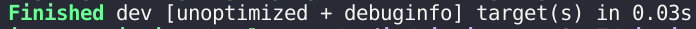

### 编译和执行 Rust 程序概览

#### 编译和执行 Rust 程序的基本知识

1. **创建和编译文件：**
   - 创建新文件夹以保存 Rust 文件，并创建 `.rs` 扩展名的文件，类似于之前教程中的 `HelloWorld.rs`。
   - Rust 文件通常以 `.rs` 扩展名结尾。添加 `main` 函数作为程序入口点。

   <p align="center">
      
   </p>

   ```rust
   fn main() {
    println!("Hello World!");
   }
   ```

2. **手动编译和执行：**
   - 使用 `rustc` 命令 + 文件名来手动编译代码文件。编译后将生成可执行文件。
   - 在终端使用 `./文件名` 运行程序，查看输出结果。

   ```bash
   rustc HelloWorld.rs
   ./HelloWorld
   ```

   <p align="center">
      
   </p>
   <p align="center">
      
   </p>
   <p align="center">
      
   </p>
   <p align="center">
      
   </p>

3. **使用 Cargo 构建和执行：**
   - Cargo 是 Rust 的包管理器，使用 `cargo new 文件夹名称` 初始化新项目。

   ```rust
   cargo new hello_world
   ```

   <p align="center">
      
   </p>

   - `Cargo.toml` 文件包含项目信息和依赖项。`src` 文件夹包含 `.rs` 扩展名的源文件。

   <p align="center">
     
   </p>

   - 使用 `cargo run` 编译并运行程序，执行结果将在终端显示。

   ```bash
   cd HelloRust/
   cargo run
   ```

   <p align="center">
     
   </p>

   <p align="center">
     
   </p>


   - `cargo build` 仅构建程序而不运行。

   ```bash
   cargo build
   ```

   <p align="center">
     
   </p>

   <p align="center">
     
   </p>

   - `cargo build --release` 用于生产环境构建，优化可执行文件性能。

   ```rust
   cargo build --release
   ```

   <p align="center">
     
   </p>

   <p align="center">
     
   </p>

4. **编译和构建选择：**
   - 在开发阶段，使用 `cargo run` 快速重建程序，调试代码。
   - 在完成代码后，使用 `cargo build --release` 进行最终构建，优化程序性能。

---

### Overview of Compiling and Executing Rust Programs

#### The basics of compiling and executing Rust programs

1. **Creating and Compiling Files:**
   - Create a new folder to store Rust files and create a file with the `.rs` extension, like `HelloWorld.rs`.
   - Rust files typically end with the `.rs` extension. Add a `main` function as the entry point to the program.

   <p align="center">
      
   </p>

   ```rust
   fn main() {
    println!("Hello World!");
   }
   ```

2. **Manual Compilation and Execution:**
   - Use the `rustc` command with the file name for manual compilation. It generates an executable file.
   - Run the program in the terminal using `./filename` to view the output.

   ```bash
   rustc HelloWorld.rs
   ./HelloWorld
   ```

   <p align="center">
      
   </p>
   <p align="center">
      
   </p>
   <p align="center">
      
   </p>
   <p align="center">
      
   </p>

3. **Building and Running with Cargo:**
   - Cargo, Rust's package manager, initializes a new project with `cargo new folder_name`.

   ```rust
   cargo new hello_world
   ```

   <p align="center">
      
   </p>

   - `Cargo.toml` file contains project information and dependencies. `src` folder holds `.rs` source files.

   <p align="center">
     
   </p>

   - Use `cargo run` to compile and execute the program, displaying the output in the terminal.

   ```bash
   cd HelloRust/
   cargo run
   ```

   <p align="center">
     
   </p>

   <p align="center">
     
   </p>

   - `cargo build` constructs the program without execution.

   ```bash
   cargo build
   ```

   <p align="center">
     
   </p>

   <p align="center">
     
   </p>

   - `cargo build --release` optimizes the executable for production environments.

   ```rust
   cargo build --release
   ```

   <p align="center">
     
   </p>

   <p align="center">
     
   </p>

4. **Compilation and Building Choices:**
   - During development, use `cargo run` for quick rebuilding and debugging.
   - After code finalization, employ `cargo build --release` for optimal performance.
