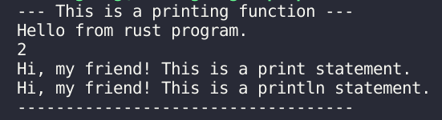
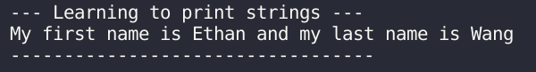
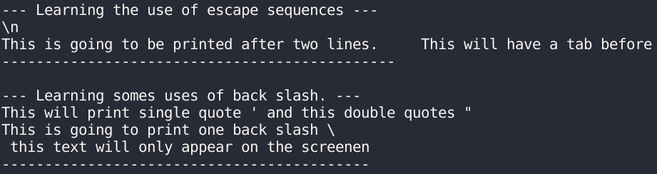
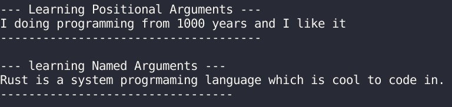
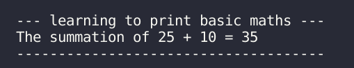

#### Comments And Outputs

1. **Comments in Rust:**  
   Comments, ignored by compilers, enhance source code readability.
   - Rust comments start with double backslashes (`//`).

   ```rust
   // This is a single-line comment.
   // This is another single-line comment.
   ```

   - Multi-line comments in Rust use `/* ... */` to span across multiple lines.

   ```rust
   /* This is a multi-line comment.
      This is another line of the comment. */
   ```

2. **Basic Print Commands:**
   - The `print!` command outputs text without a new line, while `println!` includes a new line after printing.

   ```rust
   println!("--- This is a printing function ---");
   println!("Hello from rust program.");
   print!("{}", 2);
   println!();
   print!("Hi, my friend! This is a print statement.");
   println!();
   println!("Hi, my friend! This is a println statement.");
   println!("-----------------------------------\n");
   ```
   

   - Syntax involves using placeholders (`{}`) inside double quotes to replace them with provided values.

   ```rust
   println!("--- Learning to print strings ---");
   println!("My first name is {} and my last name is {}","Ethan", "Wang");
   println!("----------------------------------\n");
   ```
   

   Printing strings and numbers requires correct placeholder formatting for their respective values.

3. **Escape Sequences:**
   - Escape sequences like `\n` (new line), `\t` (tab), and `\r` (carriage return) offer control over text layout.
   - `\\` prints a backslash, while `\'` and `\"` print single and double quotes inside a string.
   
   ```rust
   println!("--- Learning the use of escape sequences ---");
   println!("\\n\nThis is going to be printed after two lines. \t This will have a tab before");
   println!("----------------------------------------------\n");

   println!("--- Learning somes uses of back slash. ---");
   println!("This will print single quote \' and this double quotes \"");
   println!("This is going to print one back slash \\") ;
   print!("This is some text which will be overwritten \r this text will only appear on the screen");
   println!("\n-------------------------------------------\n");
   ```
   

4. **Positional and Named Arguments:**
   - Placeholders can be filled using positional arguments (`{}`, `{}`, `{}`) or named arguments (`{language}`, `{activity}`).

   ```rust
   println!("--- Learning Positional Arguments ---");
   println!("I doing {2} from {1} years and I {0} it","like",1000,"programming"); 
   println!("-------------------------------------\n");

   println!("--- learning Named Arguments ---");
   println!("{language} is a system progrmaming language which is cool to {activity} in.", language="Rust", activity = "code");
   println!("---------------------------------\n");
   ```
   

5. **Printing Basic Math Operations:**
   - Utilizing placeholders allows printing the result of mathematical operations within a print statement.
  
   ```rust
   println!("--- learning to print basic maths ---");
   println!("The summation of 25 + 10 = {}", 25 +10);
   println!("-------------------------------------\n");
   ```

   
   
---

#### 注释和输出

1. **Rust 中的注释：**
   注释在编译器中被忽略，有助于提高源代码的可读性。
   - Rust 中的注释以双斜杠（`//`）开头。

   ```rust
   // This is a single-line comment.
   // This is another single-line comment.
   ```

   - 多行注释使用 `/* ... */` 跨越多行。

   ```rust
   /* This is a multi-line comment.
      This is another line of the comment. */
   ```

2. **基本的打印命令：**
   - `print!` 命令输出文本但不换行，而 `println!` 在打印后换行。
   - 语法涉及在双引号内使用占位符（`{}`），以替换为提供的值。

   ```rust
   println!("--- This is a printing function ---");
   println!("Hello from rust program.");
   print!("{}", 2);
   println!();
   print!("Hi, my friend! This is a print statement.");
   println!();
   println!("Hi, my friend! This is a println statement.");
   println!("-----------------------------------\n");
   ```
   

   - 语法涉及在双引号内使用占位符（`{}`）来替换为提供的值。

   ```rust
   println!("--- Learning to print strings ---");
   println!("My first name is {} and my last name is {}","Ethan", "Wang");
   println!("----------------------------------\n");
   ```
   

   打印字符串和数字需要正确的占位符格式。

3. **转义序列：**
   - 转义序列如 `\n`（新行）、`\t`（制表符）和 `\r`（回车）控制文本布局。
   - `\\` 打印反斜杠，`\'` 和 `\"` 在字符串内打印单引号和双引号。

   ```rust
   println!("--- Learning the use of escape sequences ---");
   println!("\\n\nThis is going to be printed after two lines. \t This will have a tab before");
   println!("----------------------------------------------\n");

   println!("--- Learning somes uses of back slash. ---");
   println!("This will print single quote \' and this double quotes \"");
   println!("This is going to print one back slash \\") ;
   print!("This is some text which will be overwritten \r this text will only appear on the screen");
   println!("\n-------------------------------------------\n");
   ```
   

4. **位置参数和命名参数：**
   - 占位符可以使用位置参数（`{}`、`{}`、`{}`）或命名参数（`{language}`、`{activity}`）填充。

   ```rust
   println!("--- Learning Positional Arguments ---");
   println!("I doing {2} from {1} years and I {0} it","like",1000,"programming"); 
   println!("-------------------------------------\n");

   println!("--- learning Named Arguments ---");
   println!("{language} is a system progrmaming language which is cool to {activity} in.", language="Rust", activity = "code");
   println!("---------------------------------\n");
   ```
   

5. **打印基本数学运算：**
   - 利用占位符允许在打印语句中打印数学运算的结果。

   ```rust
   println!("--- learning to print basic maths ---");
   println!("The summation of 25 + 10 = {}", 25 +10);
   println!("-------------------------------------\n");
   ```
   

#### Source code
```rust
    // --------------------------------------
    //          Comments and its Different Styles
    //          Program Ouputs
    // --------------------------------------

fn main() {
    // This is a single-line comment.
    // This is another single-line comment.

   /* This is a multi-line comment.
      This is another line of the comment. */
   
    // This is a printing function
    println!("--- This is a printing function ---");
    println!("Hello from rust program.");
    print!("{}", 2);
    println!();
    print!("Hi, my friend! This is a print statement.");
    println!();
    println!("Hi, my friend! This is a println statement.");
    println!("-----------------------------------\n");

   // comments inside a command
    println!("--- comments inside a command ---");
    print/*ln*/!("Hello, world!");
    println!("\n----------------------------------\n");

    // learning some basic output commands
    println!("--- learning some basic output commands ---");
    println!("The value of the constant is {}",10);
    println!("-------------------------------------------\n");

    // Learning to print strings 
    println!("--- Learning to print strings ---");
    println!("My first name is {} and my last name is {}","Ethan", "Wang");
    println!("----------------------------------\n");

    // Learning the print command 
    println!("--- Learning the print command ---");
    print!("This is a print command "); 
    print!("This is going to be printed on the same line");
    println!("-----------------------------------\n");

    // Learing to write on multiple lines
    println!("--- Learing to write on multiple lines ---");
    print!("\nThis is going to be
            Printed on multiple 
            line");
    println!("\n------------------------------------------\n");
        
    // Learning the use of escape sequences 
    println!("--- Learning the use of escape sequences ---");
    println!("\\n\nThis is going to be printed after two lines. \t This will have a tab before");
    println!("----------------------------------------------\n");

    // Learning somes uses of back slash.
    println!("--- Learning somes uses of back slash. ---");
    println!("This will print single quote \' and this double quotes \"");
    println!("This is going to print one back slash \\") ;
    print!("This is some text which will be overwritten \r this text will only appear on the screen");
    println!("\n-------------------------------------------\n");

    // Learning Positional Arguments
    println!("--- Learning Positional Arguments ---");
    println!("I doing {2} from {1} years and I {0} it","like",1000,"programming"); 
    println!("-------------------------------------\n");

    // learning Named Arguments 
    println!("--- learning Named Arguments ---");
    println!("{language} is a system progrmaming language which is cool to {activity} in.", language="Rust", activity = "code");
    println!("---------------------------------\n");

    // learning to print basci maths 
    println!("--- learning to print basic maths ---");
    println!("The summation of 25 + 10 = {}", 25 +10);
    println!("-------------------------------------\n");
}
```